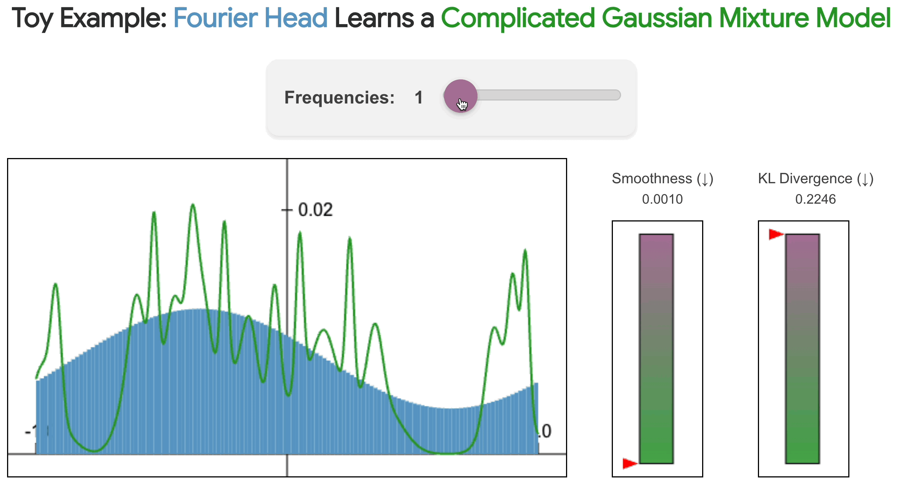

<div align="center">

#  Fourier Head:<br />Helping Large Language Models Learn<br />Complex Probability Distributions

[](https://nategillman.com/fourier-head)
[](https://nategillman.com/fourier-head)
[](https://opensource.org/licenses/MIT)

</div>

The official PyTorch implementation of the paper [**"Fourier Head: Helping Large Language Models Learn Complex Probability Distributions"**](https://nategillman.com/fourier-head).
Please visit our [**webpage**](https://nategillman.com/fourier-head) for more details.



## Using the Fourier head in your own work

In [fourier_head.py](fourier_head.py) we implement the Fourier head.
This is a self-contained file, so you can copy it into your codebase and import it like you would any neural network layer.
Example usage:

```python
import torch
import torch.nn as nn
from fourier_head import Fourier_Head

class MyNetwork(nn.Module):
    def __init__(self, input_dim=16, output_dim=18, num_frequencies=42, device="cpu"):
        super(MyNetwork, self).__init__()
        
        # Initialize Fourier head with specified input and output dimensions
        self.classification_head = Fourier_Head(input_dim, output_dim, num_frequencies, device=device)
        
    def forward(self, x):
        # Pass input through the Fourier head
        return self.classification_head(x)  # Maps (batch_size, input_dim) --> (batch_size, output_dim)


device = "cuda" if torch.cuda.is_available() else "cpu"
tensor_input = torch.randn(32, 16).to(device) # Batch size 32, input dimension 16
model = MyNetwork(device=device).to(device)
tensor_output = model(tensor_input)
print(tensor_output.shape)  # Expected shape: (32, 18)
```

Note: some very old versions of PyTorch (e.g. the one used in the original Decision Transformer repo) 
can't execute `torch.nn.functional.conv1d` on complex-valued tensors.
We provide an implementation that works in this case inside [imitation-learning/mingpt/_fourier_head.py](imitation-learning/mingpt/_fourier_head.py).

## Recreating results from paper

Our paper contains four sets of experiments with the Fourier head.
Look inside the corresponding subdirectory for the code to recreate the results and figures from that section of the paper.

1. [Toy example (synthetic data)](/toy-example-synthetic/README.md)

2. [Toy example (audio classification)](/toy_example_audio/README.md)

3. [Large scale example (imitation learning)](/imitation-learning/README.md)

4. [Large scale example (probabilistic time series forecasting)](/time-series-forecasting/README.md)

## Acknowledgments

We thank the authors of the works we build upon:
- [SynTheory](https://huggingface.co/datasets/meganwei/syntheory)
- [Decision Transformer](https://github.com/kzl/decision-transformer)
- [Chronos](https://github.com/amazon-science/chronos-forecasting)

## Bibtex

If you find this code useful in your research, please cite:

```
@misc{ARXIV_COMING_SOON
}
```